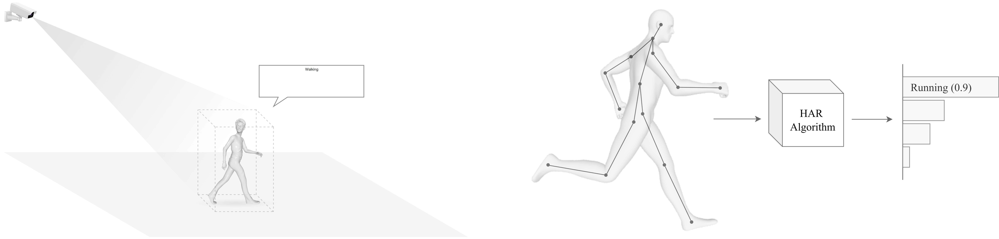
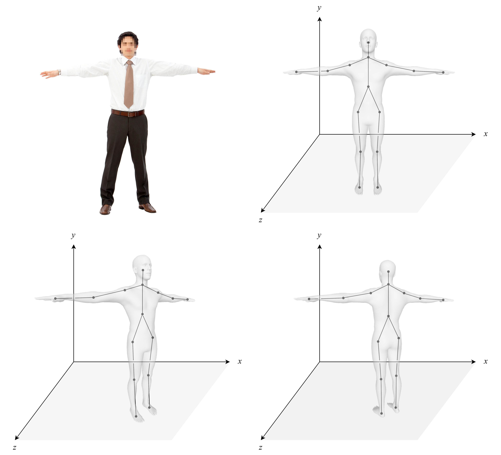
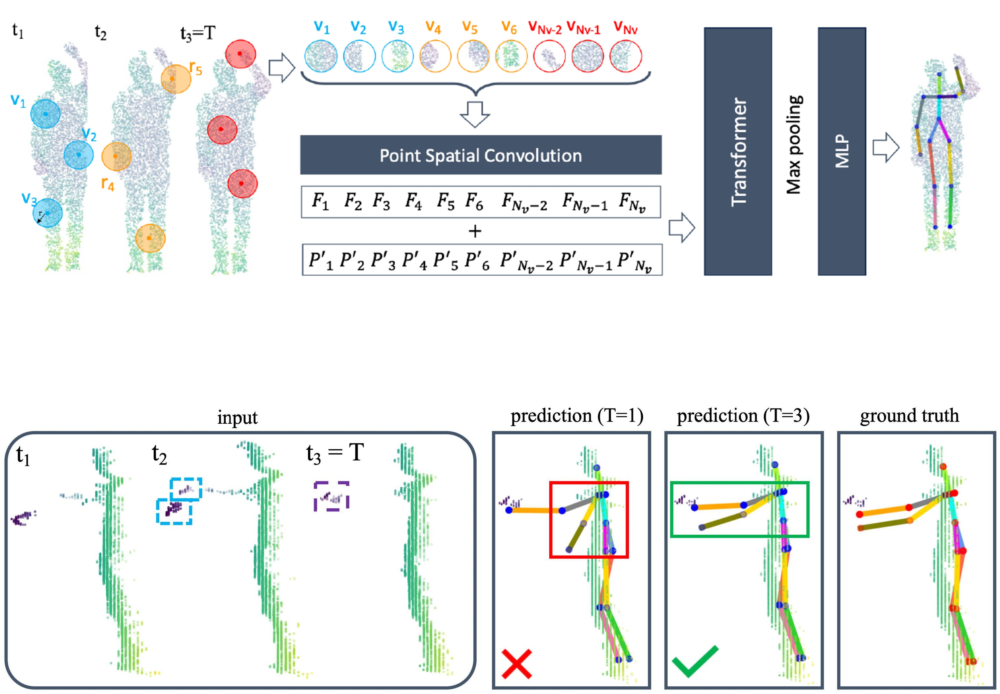
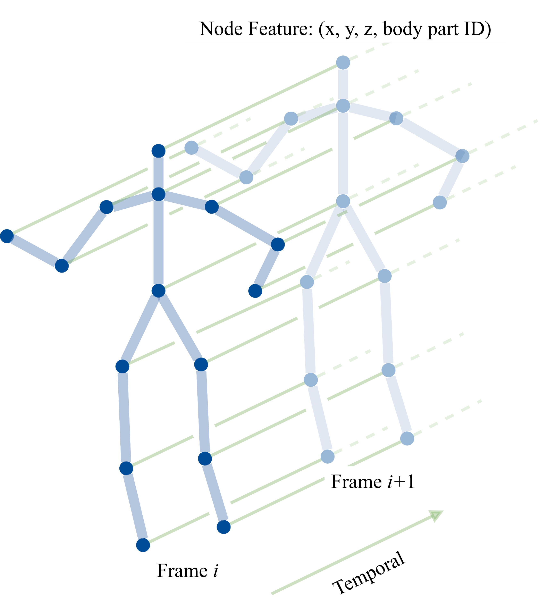
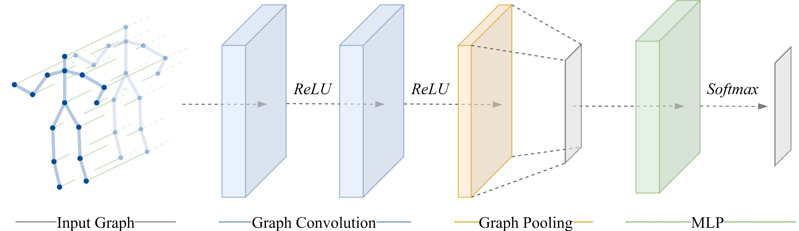
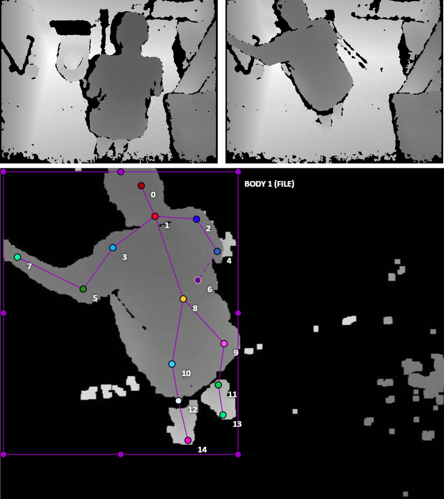
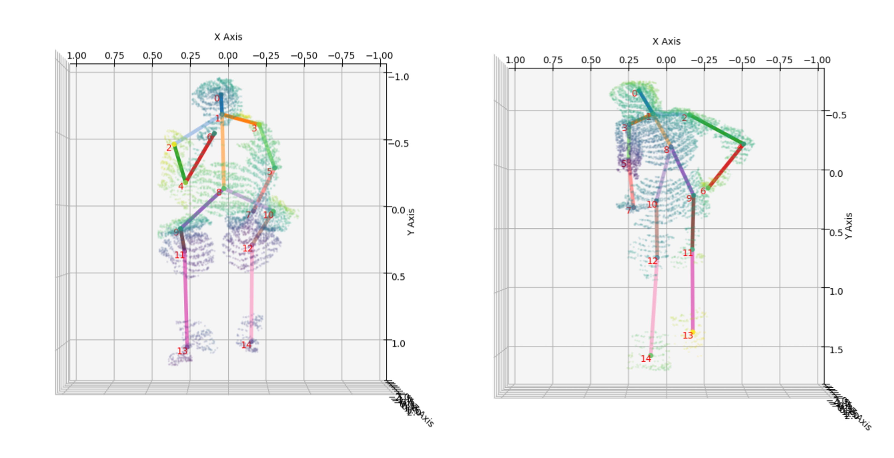
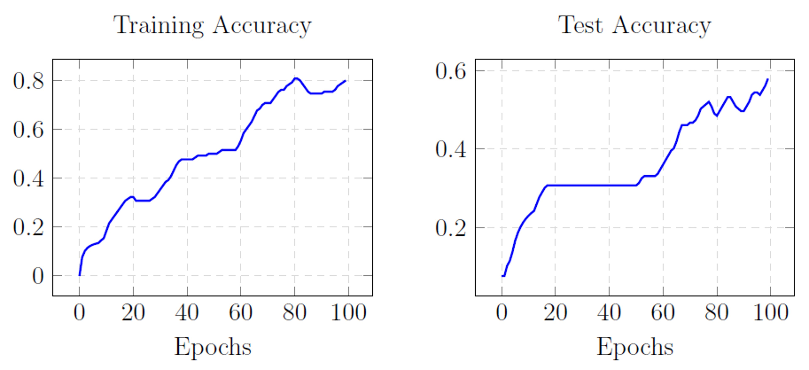

# Human Action Recognition from Depth Maps

This repository contains the implementation of a system for **Human Action Recognition (HAR)** using depth map data. The system is designed to assist individuals with dementia in bathroom settings by recognizing human actions in a privacy-preserving manner. The project integrates cutting-edge deep learning techniques, utilizing the **SPiKE** model for **3D Human Pose Estimation (HPE)** and a **Relational Graph Convolutional Network (RGCN)** for **action classification**.



---

## **Overview of the System**

The system pipeline consists of the following stages:

1. **Depth Map Acquisition**: Collects 3D depth data in bathroom environments using depth sensors.
2. **Point Cloud Generation**: Converts depth maps into 3D point clouds, which represent spatial distributions.
3. **3D Skeleton Estimation (SPiKE Model)**: Extracts the skeletal structure of humans from the point clouds.
4. **Spatio-Temporal Graph Construction**: Builds graphs where nodes represent body joints, and edges encode spatial and temporal relationships.
5. **Action Classification (RGCN Model)**: Predicts human actions using the relational information in the spatio-temporal graph.

This system aims to provide real-time assistance while preserving user privacy by avoiding the capture of detailed visual information.

### **System Architecture**


---

## **Deep Learning Models**

### **SPiKE Model for 3D Human Pose Estimation**
The SPiKE model is a neural network designed to predict 3D human poses from point clouds. It performs the following:
- **Local Feature Extraction**: Analyzes spatial features in local volumes of the point clouds.
- **Temporal Encoding**: Utilizes a transformer network to model motion dynamics.
- **Pose Regression**: Outputs 3D coordinates for 15 human body joints, ensuring robust and accurate skeletal representations.

> The model was fine-tuned on a custom dataset, **BAD**, annotated with 2D skeletons, to improve its performance in real-world settings.

### **Visualizing a Skeleton**


### **SPiKE Model Workflow**


---

### **Relational Graph Convolutional Network (RGCN)**
The RGCN extends traditional graph neural networks to handle **spatial** and **temporal** relationships between skeleton joints. Features include:
- **Graph Construction**: Represents human poses as graphs, with joints as nodes and spatial-temporal connections as edges.
- **Relational Convolutions**: Uses distinct convolutional operations for different types of edges, such as spatial or temporal.
- **Action Classification**: Processes graph data to identify one of eight actions, including walking, sitting, and washing hands.

### **What is a Spatio-Temporal Graph?**


### **RGCN Architecture**


---

## **Dataset**

The system is trained and tested on the **BAD dataset**, a custom dataset of depth maps recorded in bathroom settings. This dataset includes:
- **Depth Maps**: 3D representations of the environment.
- **Annotations**: 2D skeletons manually labeled for training.
- **Actions**: Eight human actions like sitting, standing, and washing hands.

### **Dataset Example**


---

## **Results**

### **SPiKE Model Results**
- Quantitative: High **mean Average Precision (mAP)** and **Percentage of Correct Keypoints (PCK)** across key joints.
- Qualitative: Strong alignment of predicted skeletons with ground truth.



### **RGCN Model Results**
- Quantitative: Consistently decreasing training/testing losses and increasing accuracies.
- Qualitative: Accurate classification of human actions in testing scenarios.



---

## **Key Features**
- **Privacy-Preserving**: Works with depth sensors to ensure individuals' dignity and anonymity.
- **Real-Time Processing**: Designed for real-time human action recognition in practical scenarios.
- **Custom Dataset Support**: Fine-tuned and tested on the BAD dataset for accurate performance in bathroom environments.
- **Extendable Framework**: Can incorporate additional actions or adapt to other domains by modifying the graph construction and model training pipelines.

---

## **Getting Started**

1. **Setup Environment**:
   Install dependencies using:
   ```bash
   pip install -r requirements.txt
